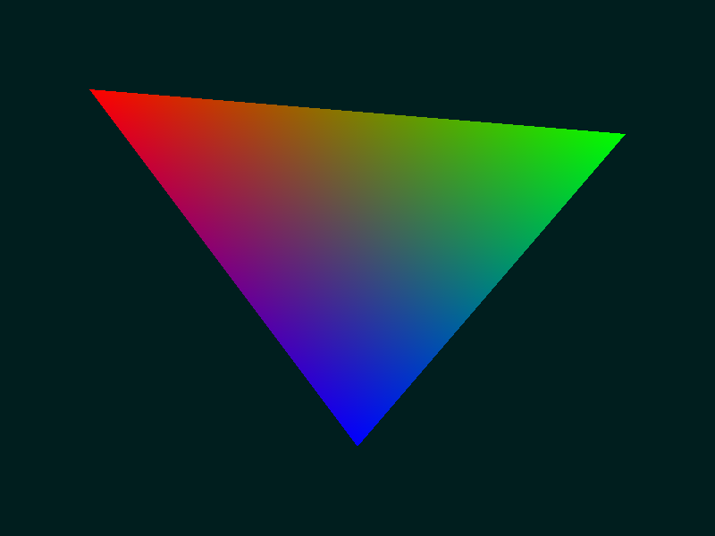

# Software Rasterizer

A minimal software rasterizer written in C. Goal wasn't to build a full rasterizer, it was to understand what actually happens inside one.

Kept it to a single triangle. Simple enough to read top to bottom and understand every step.

## Output

A PNG image of an interpolated triangle rendered entirely on the CPU, no GPU involved.



## How it works

### 1. Framebuffer

Just a flat array of bytes in memory `width * height * 3` bytes for RGB. Everything gets written here, then saved as a PNG at the end using `stb_image_write`.

### 2. Edge function

```c
float edgeFunction(Vec2 a, Vec2 b, Vec2 c) {
    return (c.x - a.x) * (b.y - a.y) - (c.y - a.y) * (b.x - a.x);
}
```
This is just a 2D cross product. Given two edge points `a`, `b` and a point `c`, it tells you which side of the edge `c` is on. positive, negative, or zero (on the edge).

It also doubles as area: `edgeFunction(v0, v1, v2)` gives you twice the area of the triangle. This is the same operation used for barycentric coordinates.

### 3. Bounding box

Instead of looping over every pixel on screen, compute the min/max of the triangle's vertices and only iterate within that box.

### 4. Per-pixel test

For each pixel in the bounding box, sample the center (`x + 0.5, y + 0.5`) and run the edge function against all three edges:

```c
float w0 = edgeFunction(v1.position, v2.position, p);
float w1 = edgeFunction(v2.position, v0.position, p);
float w2 = edgeFunction(v0.position, v1.position, p);
```

If all three have the same sign, the point is inside the triangle.

### 5. Barycentric coordinates

Divide each weight by the total triangle area:

```c
w0 /= area;  w1 /= area;  w2 /= area;
```

Now `w0 + w1 + w2 = 1`. These are the barycentric coordinates - how close the pixel is to each vertex, and you use them to interpolate any per-vertex attribute (color here, but same idea for UVs, normals, depth).

```c
float r = w0*v0.color.r + w1*v1.color.r + w2*v2.color.r;
```

## Build

```bash
gcc rasterizer.c -o rasterizer -lm
./rasterizer
```

Outputs `output.png`.

## Dependencies

- [stb_image_write](https://github.com/nothings/stb/blob/master/stb_image_write.h)
